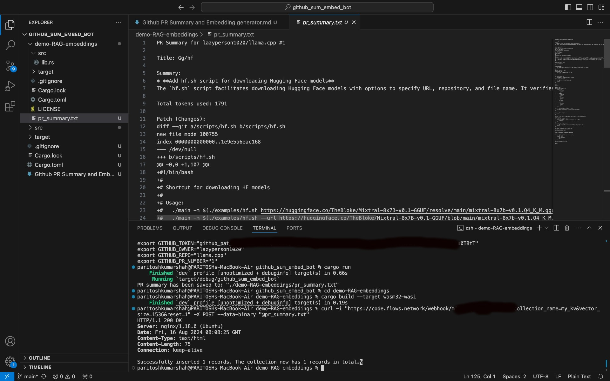
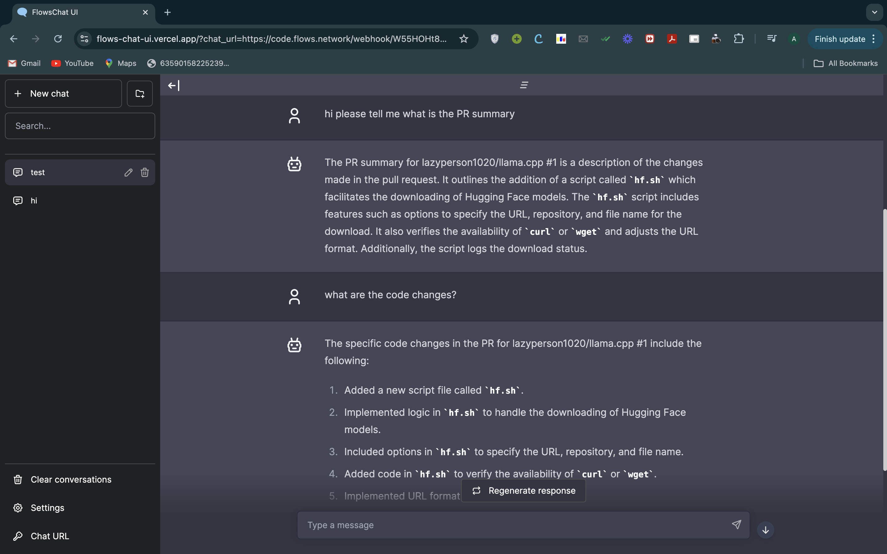

# Github PR Summary and Embedding generator (LFX-WasmEdge)
## _Bot to create embeddings for any github pull request_

#### Prerequisites to use it
 As this bot is nothing but an amalgamation of flows.network technologies, you will first need to register on flows.network. Next, you need the OpenAI integration as given in the flows.network RAG embeddings demo [repo](https://github.com/flows-network/demo-RAG-embeddings). As per it's instructions, you will get the Webhook endpoint which will be utilised further for the chat-app [repo](https://github.com/flows-network/demo-RAG-chatbot-web). To use this bot, you will also need API keys for OpenAI and Github and follow the instructions as given below. Please dont forget to download all necessary dependencies and packages such as rust, llvm, wasmedge, etc in your system before building this bot from soure.
#### Building from source
 Just execute the following command in your terminal to clone this repo.
```sh
git clone 
```
When cloned, set the github repository owner name (for which you want to generate the pr summary); github repository name ; github api key; openAI api key and the corresponding pull request number. Let's say for the [PR](https://github.com/lazyperson1020/llama.cpp/pull/1) the github owner is "lazyperson1020", github repo is "llama.cpp", github pull request number is "1". 


```sh
cargo build
export OPENAI_API_KEY="your-openai-api-key"
export GITHUB_TOKEN="your-github-token"
export GITHUB_OWNER="github-owner"
export GITHUB_REPO="github-repo"
export GITHUB_PR_NUMBER="x"
cargo run
```
Once you have build everything and ran the commands, you will need the WeBhook endpoint as said earlier and use the following command to create the embeddings to further use it. You can change the collection name, vector size according to your choice.

```sh
cd demo-RAG-embeddings
cargo build --target wasm32-wasi
curl -i "https://code.flows.network/webhook/MY-FLOW-FUNCTION-ID?collection_name=my_kb&vector_size=1536&reset=1" -X POST --data-binary "@pr_summary.txt"
```

Now to start the chat-app, just follow the instruction on the [repo](https://github.com/flows-network/demo-RAG-chatbot-web). Use the WeBhook endpoint url and set the parameters accordingly like the collection_name ; system_prompt ; and error_mesg and run the following with appropriate changes.
```sh
https://flows-chat-ui.vercel.app/?chat_url=https://code.flows.network/webhook/a-z
```

## Testing

The bot was deployed and tested on the "https://github.com/lazyperson1020/llama.cpp/pull/1" repo on pull request number "1". 
View it [here](https://github.com/lazyperson1020/llama.cpp/pull/1)

The following were the outcomes of this bot 
Logs & Generated text file:-

Chatting through gaianet endpoint:-


# Made by ARNAV SHAH for LFX-wasmedge'24-term3
